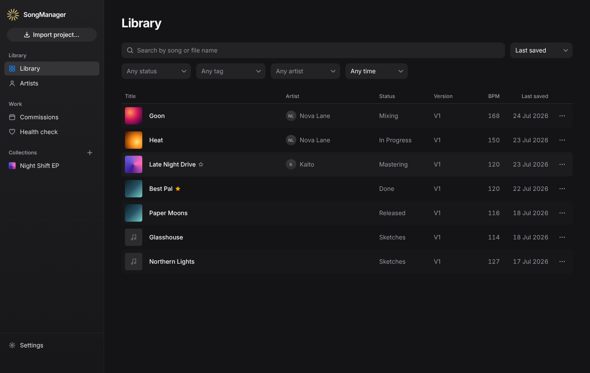
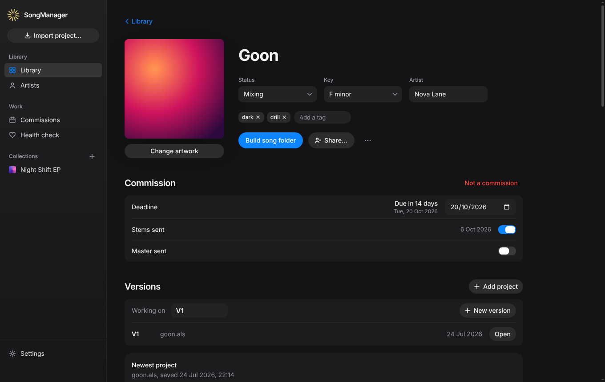
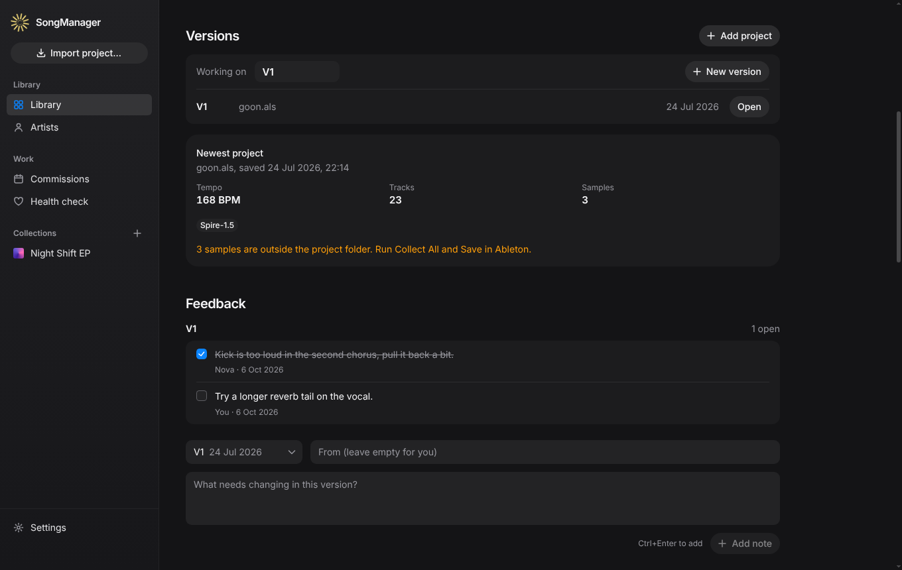
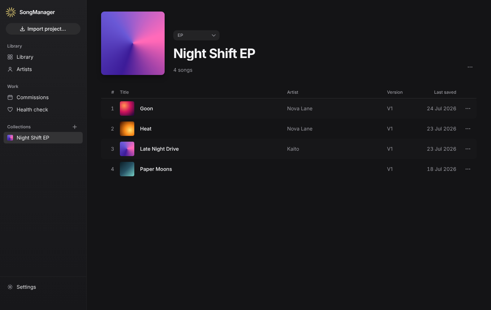
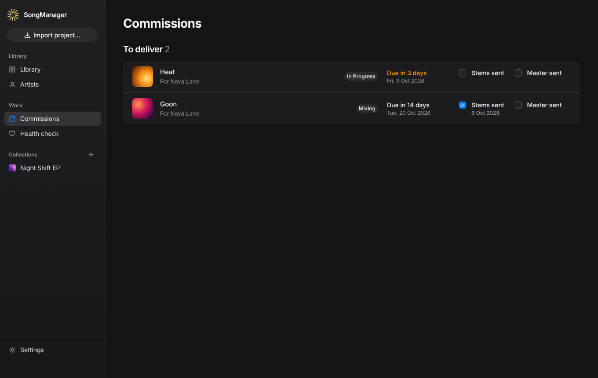
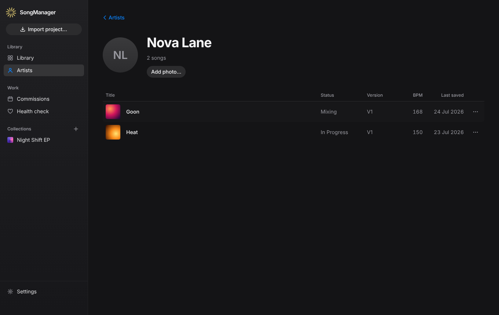
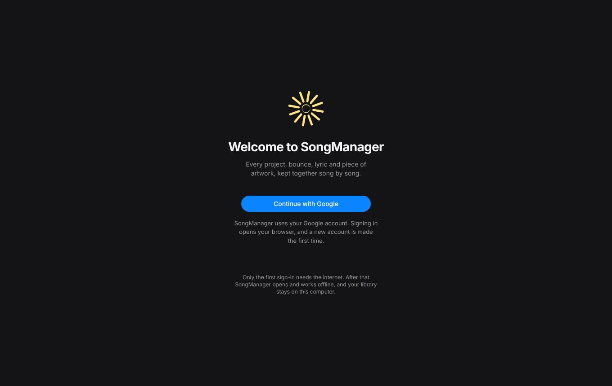

  

<h1 align="center">SongManager</h1>

  Every project, bounce, lyric and piece of artwork, kept together song by song.

  <a href="https://github.com/xutesan/SongManager-releases/releases/latest"><strong>Download for Windows</strong></a>

  

SongManager is a calm, organisational home for your music. It finds your Ableton projects wherever they live, across every drive, and gathers each song's versions, bounces, lyrics, artwork and notes in one place. Your files stay exactly where they are. SongManager only reads them, and never changes a project.

## Download

Get the latest installer, `SongManager-Setup-<version>.exe`, from the [Releases page](https://github.com/xutesan/SongManager-releases/releases/latest).

1. Download and open the installer.
2. If Windows says it protected your PC, choose **More info**, then **Run anyway**.
3. Open SongManager and continue with your Google account.

SongManager updates itself. When a new version is ready, it asks you to restart.

## Requirements

- Windows 10 or 11 (64-bit)
- Ableton Live 12 projects (`.als`)
- A Google account, and an internet connection for the first sign-in

## What it does

- **Finds your projects in place.** Point SongManager at your project folders, on any drive, and it keeps watching them. Nothing is moved or copied unless you ask.
- **Groups versions for you.** Projects in the same folder become one song with V1, V2 and onwards. Drag one song onto another to merge them.
- **Matches your bounces.** WAV and MP3 exports are found in the project folder and your exports folders, and played right in the app.
- **Keeps the details together.** Lyrics, notes, artwork, tags, key and tempo, all on the song's own page.
- **Tracks where each song is.** Sketches, In Progress, Mixing, Mastering, Done and Released.
- **Organises by artist and collection.** See every song for an artist, or build albums, EPs and playlists.
- **Helps you deliver.** Commission deadlines, stems and master sent, feedback notes per version, and a tidy delivery package.
- **Builds a song folder.** Copies every file a song needs into one place. Your originals are never moved or deleted.
- **Checks your projects' health.** Spots missing samples and plugins that aren't installed.
- **Shares with collaborators.** Invite people to a song so you can work on it together.
- **Syncs between your computers.** Your library follows you, and works offline after the first sign-in. Drives that are unplugged simply show their songs as offline.

## A closer look

  
   Each song has its own page: artwork, status, key, artist, tags and commission.

  
   Versions, what is inside the newest project, and feedback for each version.

  
   Albums, EPs and playlists, with their own cover.

  
   Commissions at a glance, with what is due and what has been sent.

  
   Every song for an artist, in one place.

  
   Sign in once, then SongManager opens and works offline.

## About this repository

This repository holds SongManager's installers and update files. Each release on the [Releases page](https://github.com/xutesan/SongManager-releases/releases) has the installer and its release notes.

Made by rell.

